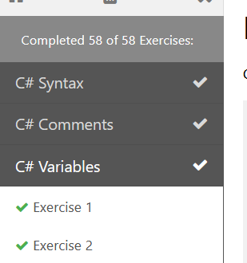

# C# Fundamentals Assignment
The goal of this assignment is to ensure that I am familiar with the fundamentals of programming in C#. The exercises were provided by 
[w3schools.com](https://www.w3schools.com/cs/exercise.asp?filename=exercise_syntax1).

## Installation

```bash
$ git clone https://github.com/jia-von/c-fundamentals-assignment-w3.git
$ git fetch --all
$ cd C-Fundamentals-Assignment-W3
$ start devenv C-Fundamentals-Assignment-W3.sln
`````
## Usage/Approach

I completed each one of the 58 exercises posted on [w3schools.com](https://www.w3schools.com/cs/exercise.asp?filename=exercise_syntax1).
- When an exercise is completed, I create a new branch in my repository with the name: **$number_$description** where **$number** is the exercise number and **$description** is a description of the topic. Example: **03_VariableAssignment** (prefixing single digits with 0 stops bad alphabetical reorganization).
- When completed, I took a screenshot of the final page showing **58 of 58 Complete** and put the screenshot in the master branch of my repository.



### Additional Challenges

I took the challenge of completing one **Hard** C# [edabit](https://edabit.com/challenge/thXMEAWNWyk9cCZcM), **Multiple Choice Tests**. I completed the challenge and placed my solution on a branch called **Challenge_1**. 

